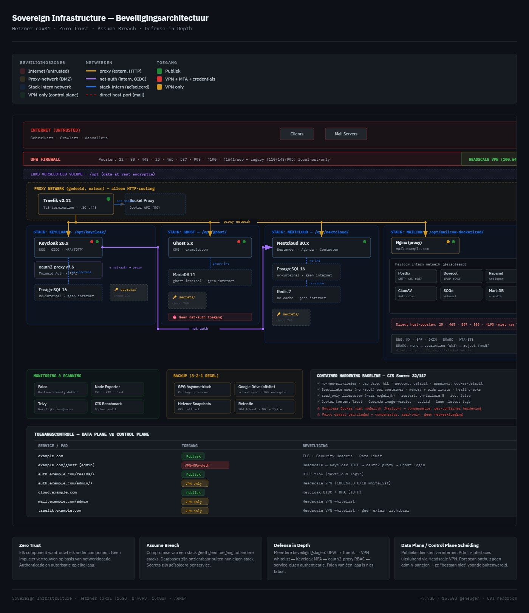

# Sovereign Stack

A self-hosted, zero-trust infrastructure running on a single Hetzner Cloud VPS (cax31 ARM64, 16GB RAM). Designed for small business use with full data sovereignty — no SaaS dependencies for core services.

## Architecture

Four isolated application stacks behind a hardened reverse proxy, with centralized identity management and self-hosted VPN for administration.



| Stack | Service | Purpose |
|-------|---------|---------|
| **Traefik** | Traefik v2.11 + Socket Proxy | TLS termination, routing, Let's Encrypt |
| **Keycloak** | Keycloak 26.x + PostgreSQL + oauth2-proxy | SSO, OIDC, MFA (TOTP), forward-auth |
| **Ghost** | Ghost 5.x + MariaDB | Website / CMS |
| **Nextcloud** | Nextcloud 30.x + PostgreSQL + Redis | Files, calendar, contacts |
| **Mailcow** | Mailcow (17 containers) | Email, webmail (SOGo), antispam, antivirus |
| **Headscale** | Headscale 0.26 | Self-hosted Tailscale control server (VPN) |
| **Monitoring** | Falco + Node Exporter + Trivy | Runtime anomaly detection, metrics, vulnerability scanning |

## Security Model

**Principles:** Zero Trust · Assume Breach · Defense in Depth

### Network Isolation

Each stack runs in its own Docker Compose project with dedicated internal networks. Only two networks are shared:

- **`proxy`** — HTTP routing only, connects Traefik to application frontends
- **`net-auth`** — OIDC authentication, connects Keycloak to Nextcloud

All database networks are `--internal` (no internet access). Cross-stack communication is blocked — a compromised Ghost container cannot reach Keycloak's database or Nextcloud's files.

```
Internet → UFW → Traefik (TLS) → proxy network → Application frontends
                                                         │
                              Each app ←→ Own DB (internal network, isolated)
```

### Data Plane vs Control Plane

Public services are accessible from the internet. Admin interfaces are exclusively behind the Headscale VPN — they return 403 Forbidden to the public internet.

| Access Level | Services |
|-------------|----------|
| **Public** | Ghost website, Nextcloud, Keycloak OIDC endpoints, Mailcow webmail, SMTP/IMAP |
| **VPN + MFA** | Ghost admin (`/ghost`), Keycloak admin (`/admin`), Mailcow admin, Traefik dashboard |
| **SSH key only** | Server management (port 22) |

### Container Hardening

Every managed container enforces:

- `security_opt: no-new-privileges` — prevents privilege escalation
- `cap_drop: ALL` + minimal `cap_add` — principle of least privilege
- `seccomp: default` + `apparmor: docker-default` — syscall filtering
- `pids_limit` — prevents fork bombs
- Memory limits — prevents resource exhaustion
- `restart: on-failure:5` — prevents infinite restart loops
- Healthchecks — automatic failure detection
- Pinned image versions — no `:latest` tags

Docker daemon hardening: `icc: false`, `no-new-privileges: true`, `userland-proxy: false`, `live-restore: true`, Docker Content Trust enabled, auditd monitoring.

### Firewall

Only required ports are exposed. Docker's iptables bypass is mitigated by never using `ports:` on internal services.

```
Open: 22 (SSH) · 80 (HTTP→HTTPS) · 443 (HTTPS) · 25 (SMTP) · 465 (SMTPS)
      587 (Submission) · 993 (IMAPS) · 4190 (Sieve) · 41641/udp (Tailscale)
```

Legacy unencrypted ports (110/POP3, 143/IMAP, 995/POP3S) are bound to localhost only.

### Secrets Management

Each stack has its own secrets directory (chmod 700, root-only). No stack can access another stack's secrets. No passwords in docker-compose.yml or .env files — only file references.

### Backup Strategy (3-2-1)

- Automated daily via cron
- Database dumps (hot, no downtime) + config archives + application data
- GPG asymmetric encryption — public key on server, private key only on local machine
- Offsite sync via rclone (encrypted)
- Secrets excluded from backups
- 30-day local retention, 90-day offsite

### Monitoring & Auditing

| Tool | Function | Schedule |
|------|----------|----------|
| Falco | Runtime anomaly detection (syscall monitoring) | Continuous |
| Node Exporter | System metrics (CPU, RAM, disk) | Continuous |
| Trivy | Container image vulnerability scanning | Weekly |
| Healthcheck script | Service availability (HTTP + container status) | Every 5 minutes |
| auditd | Docker file/directory access auditing | Continuous |
| CIS Docker Bench | Compliance audit | On-demand |

### CIS Docker Benchmark

Score: **32/117** (up from 6 after hardening). Remaining warnings are primarily from Mailcow's managed containers (17 containers, not modifiable without breaking updates). All managed stacks pass critical security controls.

### Verified Isolation (Cross-Stack Tests)

All cross-stack connectivity tests pass (blocked):
- Application containers cannot reach other stacks' databases
- Non-mail containers cannot reach external SMTP (port 25)

### Documented Deviations

| Best Practice | Status | Compensation |
|---------------|--------|-------------|
| Rootless Docker | Not applied | Mailcow requires root daemon; per-container user, cap_drop, no-new-privileges |
| userns-remap | Not applied | Mailcow incompatible; AppArmor + Seccomp + non-root users |
| Falco privileged | Required | Needed for syscall monitoring; read-only, no network access |

## Documentation

- [docs/deployment-plan.md](docs/deployment-plan.md) — Full deployment plan with phase-by-phase instructions

## Status

Deployed and operational. Ongoing hardening and integration tasks tracked separately.

## Third-Party Software Licenses

| Software | Version | License | Project |
|----------|---------|---------|---------|
| [Traefik](https://github.com/traefik/traefik) | v2.11 | MIT | Reverse proxy, TLS termination |
| [Keycloak](https://github.com/keycloak/keycloak) | 26.x | Apache-2.0 | Identity, SSO, MFA |
| [Ghost](https://github.com/TryGhost/Ghost) | 5.x | MIT | Website / CMS |
| [Nextcloud](https://github.com/nextcloud/server) | 30.x | AGPL-3.0 | Files, calendar, contacts |
| [Mailcow](https://github.com/mailcow/mailcow-dockerized) | latest | GPL-3.0 | Email, webmail, antispam |
| [Headscale](https://github.com/juanfont/headscale) | 0.26 | BSD-3-Clause | Self-hosted VPN control server |
| [PostgreSQL](https://github.com/postgres/postgres) | 16 | PostgreSQL License | Relational database |
| [MariaDB](https://github.com/MariaDB/server) | 11 | GPL-2.0 | Relational database |
| [Redis](https://github.com/redis/redis) | 7 | BSD-3-Clause * | In-memory cache |
| [oauth2-proxy](https://github.com/oauth2-proxy/oauth2-proxy) | v7.6 | MIT | Forward authentication proxy |
| [docker-socket-proxy](https://github.com/Tecnativa/docker-socket-proxy) | latest | Apache-2.0 | Read-only Docker API proxy |
| [Falco](https://github.com/falcosecurity/falco) | latest | Apache-2.0 | Runtime anomaly detection |
| [Node Exporter](https://github.com/prometheus/node_exporter) | latest | Apache-2.0 | System metrics |
| [Trivy](https://github.com/aquasecurity/trivy) | latest | Apache-2.0 | Vulnerability scanning |
| [Docker Engine](https://github.com/moby/moby) | 27.x | Apache-2.0 | Container runtime |
| [Let's Encrypt](https://letsencrypt.org/) | — | [ISRG](https://www.abetterinternet.org/) | TLS certificates (free, automated) |

\* Redis versions ≥ 7.4 use a dual RSALv2/SSPLv1 license. Earlier versions (used here) are BSD-3-Clause.

## License

MIT — see [LICENSE](LICENSE)
